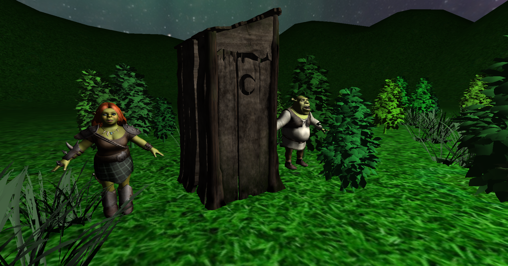
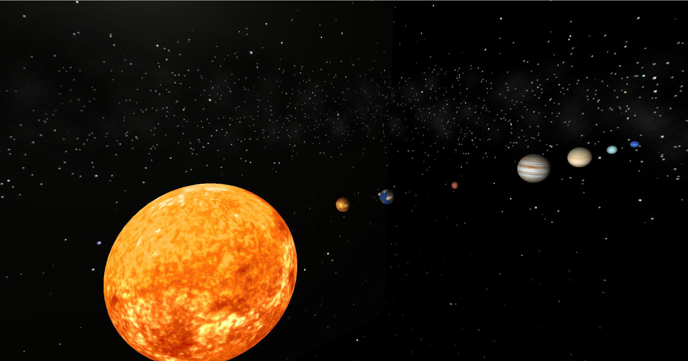

# ZPG Project — C++ / OpenGL Mini Engine

A custom OpenGL-based 3D rendering project written in C++.
The project gradually evolved into a small “mini engine” with scene management, camera controls, lighting/shading variants, textured models, skybox rendering and object picking.

> Built as part of a university computer graphics course (ZPG).

---

## ✨ Key Features

### Rendering & Shaders
- Multiple shading models:
  - **Phong** (`phong.vert`, `phong.frag`)
  - **Lambert** (`lambert.frag`)
  - **Blinn-Phong** (`blinn.frag`)
  - **Constant** (`constant.vert`, `constant.frag`)
- Shader/Program management (`Shader`, `ShaderProgram`, `ShaderManager`)
- Depth testing (Z-buffer) and standard real-time rendering pipeline

### Camera & Controls
- Camera implementation (`Camera`, `CameraController`)
- Scene navigation / view + projection setup

### Scene System
- Scene abstraction (`Scene`, `SceneManager`, `SceneFactory`)
- Multiple scenes / demos (e.g. **ShootingRange**, space scene)

### Models, Textures & Skybox
- OBJ model loading (`tiny_obj_loader.h`, `Model`, `ModelManager`)
- Texture loading (`Texture`, `stb_image.h`)
- Skybox rendering (`Skybox`, `skybox.vert`, `skybox.frag`, `skycube.h`)
- Assets structure (`Assets/`, `Models/`, `textures/`)

### Lighting
- Light representation (`Light`)
- Light management / multiple lights (`LightManager`, observer interfaces)

### Transformations & Animation
- Transformation system (translate/rotate/scale + composition)
  - `TransformTranslate`, `TransformRotate`, `TransformScale`
  - dynamic transformations (e.g. `TransformDynamicTranslate`, `TransformDynamicRotate`)
  - composite transformations (`TransformationComposite`)
- Bézier-based transformations / paths
  - `TransformBezier`, `TransformBezierSpline`, `TransformBezierSplineLoop`

### Object Picking
- Object selection using **unProject** approach (`SceneManager`, `ModelManager`)

---

## 🧱 Project Structure (high-level)

- Core application: `Application.*`, `main.cpp`
- Rendering: `Shader*`, `ShaderProgram*`, `DrawableObject*`
- Scene system: `Scene*`, `SceneManager*`, `SceneFactory*`
- Models/textures: `Model*`, `Texture*`, `Skybox*`, `ModelManager*`
- Math/transforms: `Transform*`, `AbstractTransformation*`, `TransformationComposite*`
- Utilities: `stb_image.h`, `tiny_obj_loader.h`

---

## ▶️ Build & Run (Visual Studio)

This repository contains a Visual Studio solution:

- `zpg_project_kon0500.sln`
- `zpg_project_kon0500.vcxproj`

Steps:
1. Open `zpg_project_kon0500.sln` in Visual Studio
2. Select **x64** + **Release** (recommended)
3. Build and run

> If the app fails to find assets (textures/models), check the working directory / project settings so the executable runs with the repository root as the working directory.

---

## 📸 Screenshots 

### Skybox + Texture objects

### Space scene

## 📸 Screenshots 

---

## ⚠️ Known Limitations / Notes

- Material loading from `.mtl` files is partially implemented and may require adjustments (see `Material.h`, model loading notes).
- Asset paths may depend on the working directory configuration in Visual Studio.

---

## 📚 What This Project Demonstrates

- Understanding of real-time rendering pipeline and shader programming
- Camera math (view/projection) and scene navigation
- Engine-like architecture (managers, scenes, resources)
- Object picking (unProject approach)
- Animation/transforms including Bézier spline paths
